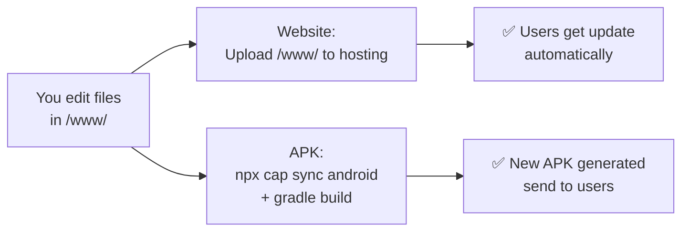
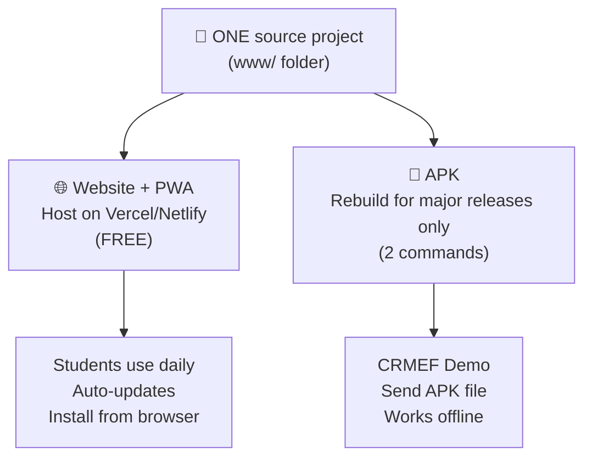

# 🔧 GéoCollège — Update & Maintenance Strategy

---

## PART 1 — Update Logic: Website vs APK

### A) PWA / Website Version

| Action | What Happens |
|--------|-------------|
| You edit `index.html` on XAMPP | ✅ Users see changes **instantly** on next visit |
| You edit CSS/JS files | ✅ Service Worker detects new version, updates cache |
| You add exercises to database | ✅ API returns new data, users get it automatically |
| You fix a typo | ✅ Refresh = fixed |
| You change design | ✅ Next visit = new design |

**How it works:**
```
You edit file → Upload to server → User opens app → Service Worker checks for updates → New version cached → Done
```

> [!TIP]
> The only thing you need to do is **bump the cache version** in `service-worker.js` (change `geocollege-v2` to `geocollege-v3`) so the SW knows to re-download everything.

### B) APK Version

| Action | What Happens |
|--------|-------------|
| You edit `index.html` in source | ❌ APK stays the **OLD** version |
| You fix a bug | ❌ Users keep the **OLD** buggy version |
| You add exercises | ❌ Users don't see them |
| You change design | ❌ Old design stays |

**To update the APK, you MUST:**
```
Edit files → Re-run `npx cap sync android` → Re-run `gradlew assembleDebug` → Send new APK to users → Users reinstall
```

### Summary Table

| Aspect | Website/PWA | APK (Static) |
|--------|------------|--------------|
| **Edit once, users see it?** | ✅ YES | ❌ NO — rebuild needed |
| **Needs rebuild?** | No | Yes, every time |
| **Users need to reinstall?** | No | Yes, every time |
| **Needs internet?** | Yes (first load) | No |
| **Works fully offline?** | After first visit | Always |
| **Update speed** | Instant | 5-10 minutes to rebuild |

---

## PART 2 — Best Professional Architecture (ONE Source)

### The Golden Rule: **Single Source of Truth**

You should NEVER have two separate copies of your code. Here's the professional architecture:

```
📁 geocollege/                    ← ONE project, ONE folder
├── 📁 www/                       ← ALL web files live here
│   ├── index.html
│   ├── formes.html
│   ├── theoremes.html
│   ├── exercices.html
│   ├── geo-animations.css
│   ├── geo-animations.js
│   ├── pwa.js
│   ├── service-worker.js
│   ├── manifest.json
│   ├── 📁 data/
│   │   ├── formes.json
│   │   ├── exercices.json
│   │   └── theoremes.json
│   └── 📁 icons/
│       ├── icon-192.png
│       └── icon-512.png
├── 📁 android/                   ← Generated by Capacitor (don't edit directly)
├── capacitor.config.json
├── package.json
└── 📁 server/                    ← Optional: PHP backend for hosted version
    ├── 📁 api/
    ├── 📁 config/
    └── 📁 admin/
```

### How Updates Work With This Architecture



### The Workflow

| Step | For Website | For APK |
|------|------------|---------|
| 1. Edit | Edit files in `www/` | Same files, same folder |
| 2. Deploy | Upload `www/` to hosting | Run `npx cap sync android` |
| 3. Build | Nothing to build | Run `gradlew assembleDebug` |
| 4. Distribute | Users visit URL | Send new APK file |

> [!IMPORTANT]
> **You edit ONCE in `www/`.** The website gets it instantly. The APK gets it after a 2-command rebuild. **Zero duplicate work.**

---

## PART 3 — Best Solution Comparison

### Option 1: Website + PWA Only

```
✅ Easiest to maintain
✅ Updates are instant
✅ Installable on Android (Add to Home Screen)
✅ Works offline after first visit
❌ Needs hosting (public URL)
❌ Not a "real" APK (no .apk file to show)
❌ Needs internet for first load
```

### Option 2: APK WebView Linked to Live Website

```
✅ Real APK file
✅ Updates from server (no rebuild needed!)
✅ Professional look
❌ NEEDS internet to work (WebView loads from URL)
❌ If server is down → app shows blank page
❌ Not truly offline
❌ Needs permanent hosting
```

### Option 3: APK Fully Offline (What We Built)

```
✅ Real APK file
✅ Works 100% offline — no internet ever needed
✅ Fast, no loading
✅ Perfect for demo
❌ Must rebuild APK for every change
❌ Users must reinstall for updates
❌ Content is frozen at build time
```

### Option 4: Hybrid Capacitor (Smart Middle Ground)

```
✅ Real APK file
✅ Works offline with cached data
✅ CAN check for updates when online
✅ Best of both worlds
⚠️ Slightly more complex to set up
⚠️ Needs a small update mechanism
```

### Verdict For Your Case

| Criteria | Option 1 (PWA) | Option 2 (WebView+URL) | Option 3 (Static APK) | Option 4 (Hybrid) |
|----------|:-:|:-:|:-:|:-:|
| Easy updates | ⭐⭐⭐⭐⭐ | ⭐⭐⭐⭐ | ⭐⭐ | ⭐⭐⭐⭐ |
| Low maintenance | ⭐⭐⭐⭐⭐ | ⭐⭐⭐ | ⭐⭐⭐⭐ | ⭐⭐⭐ |
| Student project | ⭐⭐⭐ | ⭐⭐⭐ | ⭐⭐⭐⭐ | ⭐⭐⭐⭐⭐ |
| Professional demo | ⭐⭐⭐ | ⭐⭐⭐⭐ | ⭐⭐⭐⭐⭐ | ⭐⭐⭐⭐⭐ |
| Works without hosting | ❌ | ❌ | ✅ | ✅ |
| Offline | ⚠️ After 1st visit | ❌ | ✅ Always | ✅ Always |

### 🏆 WINNER FOR YOUR CASE: **Use BOTH Option 1 + Option 3**

**Here's why:**

- **For the DEMO / CRMEF presentation** → Use the **APK (Option 3)**. Hand your professor the APK. It works instantly, offline, no internet needed. Impressive.

- **For daily use / long-term** → Use the **PWA Website (Option 1)**. Host it on free hosting (GitHub Pages, Vercel, Netlify). Students install it from their browser. Updates are instant.

- **For major updates to the APK** → Just rebuild (2 commands, 5 minutes). You don't need to rebuild for every typo — only for major releases.

---

## PART 4 — If You Change Content Frequently

### Scenario: You add exercises every week

| Strategy | Effort | User Experience |
|----------|--------|----------------|
| **PWA Website** | Edit JSON + upload | ✅ Users get it next visit |
| **Static APK** | Edit JSON + rebuild + redistribute | ❌ Users must reinstall |
| **Hybrid APK** (smart) | Edit JSON on server, app checks for updates | ✅ Auto-update when online |

### The Smart Hybrid Approach (If You Want It Later)

You can add a simple update check to your APK:

```javascript
// On app start, if online, try to fetch fresh data
async function checkForUpdates() {
  if (!navigator.onLine) return; // Skip if offline
  
  try {
    // Try to fetch fresh data from your server
    const r = await fetch('https://your-server.com/data/exercices.json');
    if (r.ok) {
      const freshData = await r.json();
      // Save to localStorage for offline use
      localStorage.setItem('exercices-cache', JSON.stringify(freshData));
      console.log('Data updated from server');
    }
  } catch(e) {
    // No internet — use cached/embedded data (already works)
  }
}

// In your load function, prefer cached data if available
function loadExercices() {
  const cached = localStorage.getItem('exercices-cache');
  if (cached) return JSON.parse(cached);
  // Fall back to embedded JSON
  return fetch('data/exercices.json').then(r => r.json());
}
```

> [!NOTE]
> This is **optional** and only useful if you plan to update exercises regularly AND have hosting. For a student project demo, the static APK is perfect as-is.

---

## PART 5 — Final Recommendation

### 🎯 The Smartest Long-Term Strategy



### Your Action Plan

| Priority | Action | When |
|----------|--------|------|
| 🟢 **Now** | Use the APK you just built for demo | ✅ Already done |
| 🟢 **Now** | Your original website still works with XAMPP + ngrok | ✅ Already works |
| 🟡 **Soon** | Host your `www/` folder on free hosting (Vercel/Netlify) | When you want a permanent URL |
| 🟡 **Soon** | Move to ONE project folder structure | When you have time to reorganize |
| 🔵 **Later** | Rebuild APK only for major version updates (v2, v3...) | Every few weeks/months |
| ⚪ **Optional** | Add hybrid update mechanism | Only if you need frequent content updates in APK |

### The Bottom Line

> [!IMPORTANT]
> **For your CRMEF student project, the current setup is PERFECT:**
> 
> - ✅ **Website** → Works via XAMPP + ngrok (or free hosting later)
> - ✅ **APK** → Ready on your Desktop, works offline, demo-ready
> - ✅ **ONE source** → Edit `www/` folder, rebuild APK when needed
> 
> **Don't over-engineer it.** You have a working website AND a working APK. That's already more than 99% of student projects. Focus on your content and your CRMEF presentation! 🎓

### Quick Rebuild Cheat Sheet

When you need to update the APK after editing files:

```powershell
# 1. If you changed exercises in the database, re-export:
c:\xampp\php\php.exe "c:\xampp\htdocs\geocollege - Copie\export-data.php"

# 2. Copy updated www files:
Copy-Item "c:\xampp\htdocs\geocollege - Copie\*.html" "c:\geocollege-apk\www\" -Force
Copy-Item "c:\xampp\htdocs\geocollege - Copie\*.css" "c:\geocollege-apk\www\" -Force
Copy-Item "c:\xampp\htdocs\geocollege - Copie\*.js" "c:\geocollege-apk\www\" -Force
Copy-Item "c:\xampp\htdocs\geocollege - Copie\data\*" "c:\geocollege-apk\www\data\" -Force

# 3. Sync + Build:
cd c:\geocollege-apk
npx cap sync android
cd android
$env:ANDROID_HOME = "C:\android-sdk"
$env:JAVA_HOME = "C:\Program Files\Java\jdk-24"
.\gradlew.bat assembleDebug

# 4. Copy new APK to Desktop:
Copy-Item "app\build\outputs\apk\debug\app-debug.apk" "$env:USERPROFILE\Desktop\GeoCollege.apk" -Force
```

**Total time: ~2-3 minutes.** That's it. 🚀
